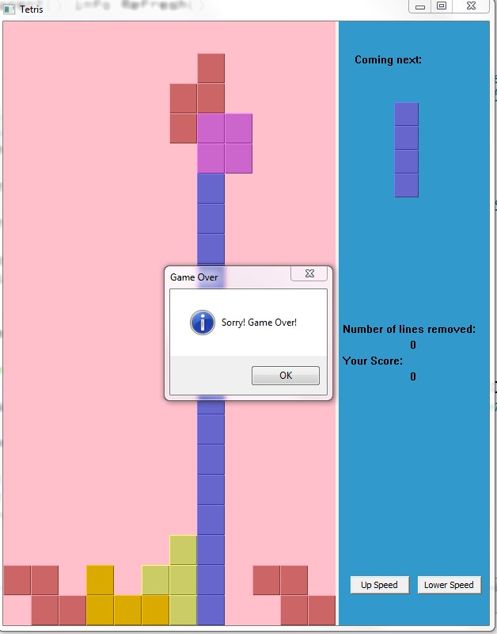

# Tetris

It's a simple Tetris game by wxPython

You have to install python and wxPython first. For more information about wxPython, find here https://wxpython.org/

Control Method:

W : rotate
A : left move
D : right move
S : one line down

Enjoy! :)

